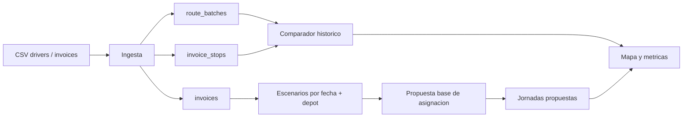
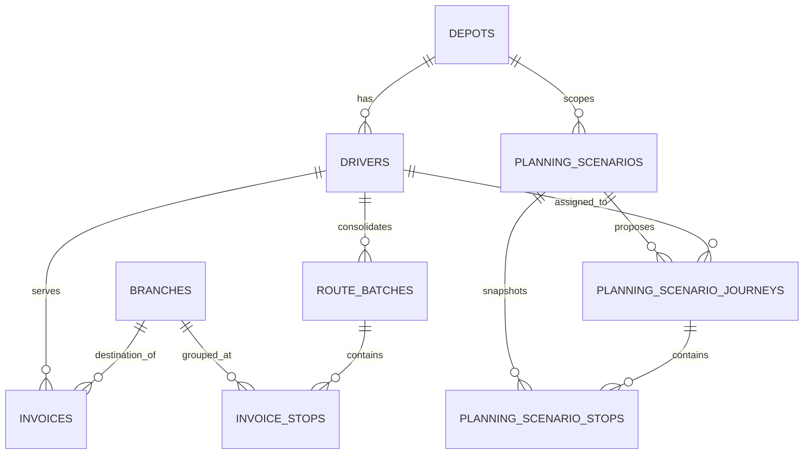

# Arquitectura actual

Resumen tecnico del estado real del producto al corte actual.

## Vista general

La aplicacion sigue siendo un monolito Laravel con frontend Inertia/Vue, pero ya no esta centrada solo en CSV + simulacion. Hoy tiene cuatro contextos claros:

1. `Ingesta historica`
2. `Comparador historico`
3. `Escenarios de planillado diario`
4. `Routing y visualizacion en mapa`



## Contextos funcionales

### 1. Ingesta historica

Responsable de aceptar CSV y convertirlos en datos operables.

Componentes clave:
- `UploadCsvController`
- `UploadCsvRequest`
- `CsvIngestionService`
- `IngestionBatch`, `IngestionRow`, `Invoice`, `RouteBatch`, `InvoiceStop`

Flujo:
1. Se crea `ingestion_batch` en estado `processing`
2. Se validan filas por tipo (`drivers` o `invoices`)
3. Cada fila genera un `ingestion_row`
4. Las facturas validas alimentan `invoices`
5. Se consolidan `route_batches` e `invoice_stops`

Reglas clave:
- `route_batches` es unico por `driver_id + service_date`
- `invoice_stops` se reconstruye por `driver + fecha`
- facturas sin sucursal o sin geocodigo quedan `pending` con `outlier_reason`

### 2. Comparador historico

Responsable de responder:
- `como fue`
- `como pudo ser`

Componentes clave:
- `SimulationController`
- `BuildJourneyComparisonService`
- `BuildSimulationRouteService`
- `resources/js/Pages/Simulation/Run.vue`

Flujo:
1. El usuario selecciona una jornada historica (`route_batch`)
2. El backend reconstruye:
   - ruta historica por orden de `historical_sequence`
   - ruta sugerida por heuristica
3. Se devuelven:
   - `historical_route`
   - `suggested_route`
   - `delta`
   - `non_comparable_stops`
   - `excluded_stops`
4. El frontend pinta mapa, metricas y listas sincronizadas

Puntos importantes:
- el comparador usa coordenadas oficiales de `branches`
- con `HERE` activo, la heuristica sugerida usa matriz vial real
- con `mock`, la ruta se dibuja como aproximacion y la UI lo advierte

### 3. Escenarios de planillado diario

Responsable de pasar de historico a propuesta operativa por `fecha + depot`.

Componentes clave:
- `PlanningScenarioController`
- `CreatePlanningScenarioService`
- `GeneratePlanningScenarioAllocationService`
- `PlanningScenario`
- `PlanningScenarioStop`
- `PlanningScenarioJourney`
- `resources/js/Pages/Planning/Index.vue`
- `resources/js/Pages/Planning/Show.vue`
- `resources/js/Components/PlanningJourneyMap.vue`

#### 3.1 Snapshot del escenario

`CreatePlanningScenarioService`:
- toma `service_date + depot`
- busca facturas del dia cuyos conductores pertenecen a ese depot
- agrupa por sucursal
- marca excluidas las paradas sin geocodigo o sin sucursal consolidable
- persiste un snapshot de demanda

Configuracion base persistida hoy:
- `return_to_depot`
- `prioritize_proximity`
- `respect_zones`
- `allow_cross_zone_assignment`
- `max_stops_per_driver`
- `max_invoices_per_journey`

#### 3.2 Propuesta base de asignacion

`GeneratePlanningScenarioAllocationService`:
- toma las paradas elegibles del escenario
- toma los conductores activos del depot
- particiona paradas con una heuristica `angular sweep`
- ordena cada jornada con `nearest neighbor`
- usa `HERE` o fallback `mock` para matriz y preview de ruta
- persiste jornadas propuestas y asignacion por parada

Heuristica actual:
- particion inicial por barrido angular desde el depot
- secuenciacion intra-jornada por vecino mas cercano
- restricciones actuales:
  - maximo de paradas por conductor
  - maximo de facturas por jornada

Estados relevantes:
- escenario:
  - `draft`
  - `snapshot_ready`
  - `empty`
  - `allocation_ready`
  - `allocation_partial`
  - `allocation_blocked`
- paradas:
  - `pending_assignment`
  - `assigned`
  - `unassigned`
  - `excluded`

### 4. Routing y visualizacion

Responsable de resolver geometria, metricas y experiencia de mapa.

Componentes clave:
- `RoutingProvider`
- `HereRoutingProvider`
- `MockRoutingProvider`
- `BuildSimulationRouteService`
- `PlanningJourneyMap.vue`
- `Simulation/Run.vue`

Resolucion de provider:
- `auto`: HERE si hay key, si no `mock`
- `here`: intenta HERE y si falla, cae a `mock`
- `mock`: genera una aproximacion siempre disponible

Detalles importantes:
- cache por `provider + waypoints ordenados + return_to_depot`
- el comparador historico y el planillado diario reutilizan la misma base de preview
- para escenarios viejos, el controlador puede reconstruir `route_preview` si el `summary` persistido no tenia `depot`, `geometry` o `bounds`

## Modelo de datos actual



Entidades principales:
- `drivers`
- `depots`
- `branches`
- `invoices`
- `route_batches`
- `invoice_stops`
- `planning_scenarios`
- `planning_scenario_stops`
- `planning_scenario_journeys`
- `ingestion_batches`
- `ingestion_rows`

Notas:
- `planning_scenarios` persiste el corte por `fecha + depot`
- `planning_scenario_stops` persiste la demanda agrupada y su estado
- `planning_scenario_journeys` persiste la propuesta por conductor

## Rutas HTTP principales

### Ingesta y consulta historica

- `GET /dashboard/upload-csv`
- `POST /dashboard/upload-csv`
- `GET /dashboard/batches`
- `GET /dashboard/batches/{routeBatch}`
- `GET /dashboard/simulate`
- `POST /dashboard/simulate/preview`
- `POST /dashboard/simulate/compare`

### Planillado diario

- `GET /dashboard/planning-scenarios`
- `POST /dashboard/planning-scenarios`
- `GET /dashboard/planning-scenarios/{planningScenario}`
- `POST /dashboard/planning-scenarios/{planningScenario}/allocate`

## Payloads relevantes

### Comparador historico

Salida simplificada de `POST /dashboard/simulate/compare`:

```json
{
  "journey": {
    "route_batch_id": 123,
    "service_date": "2026-03-05",
    "summary": {
      "total_invoices": 18,
      "total_stops": 7,
      "comparable_stops": 5,
      "non_comparable_stops": 1,
      "excluded_stops": 1
    }
  },
  "historical_route": {},
  "suggested_route": {},
  "delta": {},
  "non_comparable_stops": [],
  "excluded_stops": []
}
```

### Escenario de planillado

Salida simplificada de `GET /dashboard/planning-scenarios/{id}`:

```json
{
  "scenario": {
    "id": 3,
    "service_date": "2026-03-05",
    "status": "allocation_ready",
    "configuration": {},
    "summary": {}
  },
  "candidateStops": [],
  "excludedStops": [],
  "unassignedStops": [],
  "drivers": [],
  "proposedJourneys": [
    {
      "id": 10,
      "driver": {},
      "summary": {},
      "route_preview": {},
      "stops": []
    }
  ]
}
```

## Configuracion y runtime

Variables clave:
- `ROUTING_PROVIDER=auto|here|mock`
- `HERE_API_KEY`
- `ROUTING_CACHE_TTL_SECONDS`
- `ROUTING_FALLBACK_DEPOT_*`

En local:
- `Vite::prefetch()` se desactiva
- si usas Windows + WSL, el modo mas rapido para navegar suele ser `npm run build` + borrar `public/hot`

## Pruebas actuales

Cobertura principal:
- `tests/Feature/Ingestion/CsvImportTest.php`
- `tests/Feature/Simulation/SimulationPreviewTest.php`
- `tests/Feature/Simulation/JourneyComparisonTest.php`
- `tests/Feature/Planning/PlanningScenarioTest.php`
- `tests/Feature/HealthCheckTest.php`

## Limitaciones actuales

1. La propuesta diaria todavia parte de historicos del depot; aun no existe una fuente operativa independiente de facturas del dia.
2. Las zonas existen en esquema, pero no estan integradas de forma fuerte a la heuristica actual.
3. No hay todavia una UI completa de administracion de maestros operativos.
4. La heuristica de planillado es explicable y util para MVP, pero no es un optimizador logistico avanzado.
